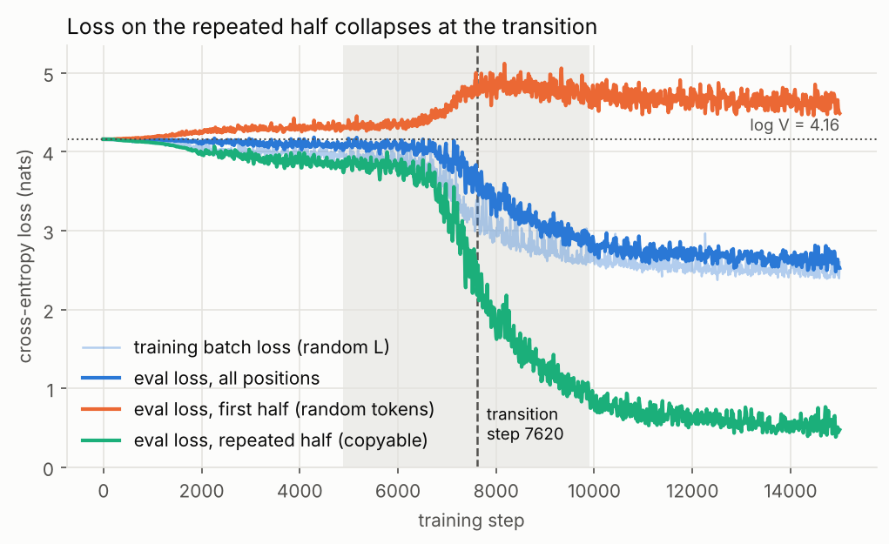
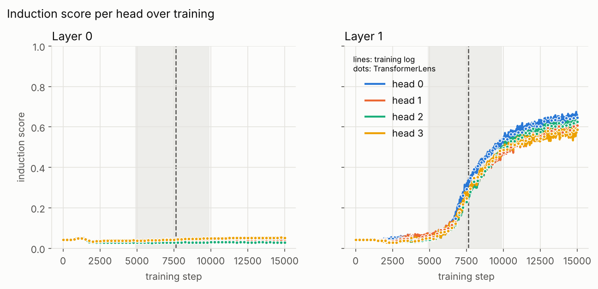
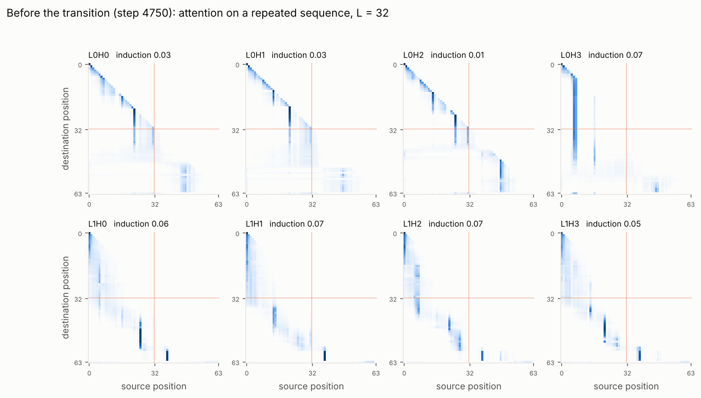
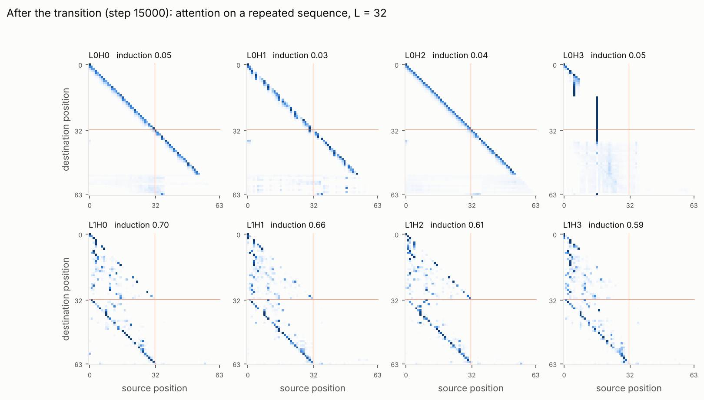

# induction-heads-from-scratch

A 2-layer attention-only transformer, written in plain PyTorch and trained from scratch on CPU, that reproduces the **induction-head phase transition**. The trained weights are loaded into a TransformerLens `HookedTransformer` for the analysis.

**Observed transition step: 7,620** (default config, seed 0). Loss on the repeated half of the sequence collapses between steps ~4,900 and ~9,900, and in the same window the layer-1 induction scores jump from ~0.05 to ~0.6.

## What are induction heads?

An induction head is an attention head that implements "if token A was followed by B earlier in the context, then after the next A, predict B". It looks for the previous occurrence of the current token, attends to the token that came *right after* it, and copies that token to the output. In a 2-layer model it needs two heads working together: a layer-0 head writes "what the previous token was" into each position, and a layer-1 head matches on that. The circuit tends to form abruptly, giving a sudden drop in in-context loss: the phase transition reproduced here ([Olsson et al., 2022](https://transformer-circuits.pub/2022/in-context-learning-and-induction-heads/index.html)).

## Reproducing the results

Tested with **Python 3.13** (3.10+ should work) on a 4-core CPU with no GPU. The tested package versions were torch 2.14.1, transformer-lens 3.9.0, numpy 2.5.3, matplotlib 3.11.2 and PyYAML 6.0.1.

```bash
git clone https://github.com/shaikabdul185-arch/induction-heads-from-scratch.git
cd induction-heads-from-scratch
python -m venv .venv && source .venv/bin/activate
pip install -r requirements.txt

# 1. Train (~8 min on a 4-core CPU)
python -m induction.train --config configs/default.yaml

# 2. TransformerLens analysis + all figures (~20 s)
python -m induction.analyze --run runs/default

# 3. Tests (~10 s)
python -m pytest
```

`requirements.txt` pins `transformer_lens<4` because TransformerLens 4.0 removed `HookedTransformer` from its public API.

The fixed-length ablation (see [below](#a-positional-shortcut-and-how-varying-the-repeat-length-fixed-it)) runs the same way:

```bash
python -m induction.train --config configs/fixed_offset.yaml
python -m induction.analyze --run runs/fixed_offset --figures figures/fixed_offset
```

### Where outputs land

| Path | Written by | Contents |
|---|---|---|
| `runs/<name>/config.yaml` | train | exact config used |
| `runs/<name>/metrics.csv` | train | one row every 10 steps: training-batch loss, eval loss (all / first half / repeated half), induction and previous-token score for every head |
| `runs/<name>/checkpoints/step_XXXXXX.pt` | train | weights every 250 steps, plus step 0 (~200 KB each) |
| `runs/<name>/transition.json` | train | detected transition (see [detection](#how-the-transition-is-detected)) |
| `figures/*.png` | analyze | the figures below |
| `results/<name>/` | analyze | copies of `config.yaml` and `metrics.csv`, plus `summary.json` (transition, TransformerLens match, repeat-length check) |

`runs/` is git-ignored. The `figures/` and `results/` directories in this repo hold the outputs of the runs reported below.

Everything is seeded (`seed: 0` for init and training data, `eval_seed: 12345` for the fixed eval batch). A different CPU or thread count can change floating-point rounding, which may shift the transition step slightly. A single-thread run of the same hyperparameters, trained for 20k steps and logged every 50, put the midpoint at step 7,700.

## Setup

**Data.** Each sequence is `L` uniformly random tokens followed by the same `L` tokens again: `[x1 … xL, x1 … xL]`. The first half can't be predicted, so its loss can't beat log V = 4.16 nats. The second half can be predicted only by copying from context. `L` is sampled per batch from [8, 32]. The [section below](#a-positional-shortcut-and-how-varying-the-repeat-length-fixed-it) explains why it varies. Evaluation uses a fixed batch of 256 sequences with `L = 32`.

- *first-half loss*: predictions of targets at positions 1 … L−1
- *repeated-half loss*: predictions of targets at positions L+1 … 2L−1 (the current token has occurred before)
- *induction score* of a head: the average attention from each token to the token right after its previous occurrence(s), over all positions where such a token exists (`induction/metrics.py`)

**Model** (`induction/model.py`): token embedding + learned positional embedding → 2 × causal multi-head attention (residual, **no MLPs**, LayerNorm off by default; it can be turned on with `use_layernorm: true`) → linear unembedding. 45,632 parameters.

### Hyperparameters (`configs/default.yaml`)

| | | | |
|---|---|---|---|
| vocab size | 64 | optimizer | AdamW, β = (0.9, 0.99) |
| repeat length L | 8–32 (per batch) | learning rate | 1e-3, constant |
| context length | 64 | weight decay | 0 |
| layers | 2 (attention only) | grad-norm clip | 1.0 |
| d_model | 64 | batch size | 64 |
| heads × d_head | 4 × 16 | training steps | 15,000 |
| LayerNorm | off | log every | 10 steps (eval batch 256) |
| init | N(0, 0.02²), zero biases | checkpoint every | 250 steps |
| seed | 0 | | |

I chose these up front so training would finish on CPU in minutes. I did not tune them to move the transition. One short exploratory comparison (lr 1e-3 vs 3e-3, vocab 64 vs 128, 20k steps each) is described under [notes](#notes-and-limitations).

## Results

### Loss curves



The repeated-half loss (green) drifts only slightly below log V for the first ~6k steps, then falls sharply to ~0.5 nats. The dashed line marks the detected transition at **step 7,620**, and the grey band is the 10%–90% window of the drop (steps 4,880–9,900). The first-half loss (orange) can't improve, and it actually rises above log V during the transition: the model starts betting on tokens it has already seen, which is wrong for fresh random tokens.

### Induction score per head



All four layer-1 heads become induction heads at the same time as the loss drops. L1H0 crosses its 50% level at step 7,730, 110 steps after the loss midpoint. The final scores are 0.57–0.64. Layer-0 heads stay near 0.05, as they should, because a single layer can't implement induction. The lines are the dense training log from the PyTorch model. The dots are recomputed every 250 steps from the TransformerLens `HookedTransformer` activation cache, and they sit on the lines.

### Attention patterns on a repeated sequence (L = 32)

Before the transition (step 4,750, the last checkpoint before the drop):



After training (step 15,000):



After the transition, every layer-1 head shows the induction stripe: from destination `t` in the second half to source `t − L + 1`, the token after the earlier copy of the current token. Three layer-0 heads attend along a narrow band covering the current token (0.34–0.54 of their attention) and the previous token (0.22–0.33). That puts the previous token's identity into each position, which is what the layer-1 heads match on.

### TransformerLens check

`induction/tl_convert.py` maps the PyTorch weights into a `HookedTransformer` (`attn_only=True`, `n_layers=2`, standard positional embeddings, no normalization). The analysis loads all 61 checkpoints into it and compares logits on the eval batch: **max |difference| = 0.0** on every checkpoint. The test suite also checks the match to within 1e-5, with LayerNorm on and off, using large random weights and biases so that a layout mistake can't hide behind a small init.

### Transition summary (`results/default/summary.json`)

| Signal | 10% | 50% | 90% |
|---|---|---|---|
| repeated-half loss (log V → 0.54) | 4,880 | **7,620** | 9,900 |
| L1H0 induction score (0.04 → 0.64) | 6,270 | 7,730 | 10,950 |

The steepest point of the smoothed loss drop is at step 7,350.

## A positional shortcut, and how varying the repeat length fixed it

My first version used a **fixed** repeat length L = 32. It also showed a clean-looking transition: the repeated-half loss dropped at ~1,300 steps and the layer-1 "induction score" rose to ~0.6. But the attention heatmaps looked wrong. The layer-1 stripe stopped a few positions before the end of the sequence, and no layer-0 head attended to the previous token (scores ≈0.05), even though a real induction head depends on one.

I tested the trained model on repeated sequences of other lengths. It failed outright on them, so it hadn't learned induction. With the copy always exactly 31 positions back, the model had learned the purely positional rule **"attend to position t − 31"** from the learned positional embeddings. On L = 32 that rule picks the same source token as an induction head, so the induction score couldn't tell them apart. The repeat-length test can.

The fix is to sample L per batch from [8, 32]. Every sequence is still "first half repeated in the second half", but the offset changes from batch to batch, so position alone can't locate the copy and the model has to match on content. The fixed-length setup is kept as an ablation in `configs/fixed_offset.yaml`, which is identical to the default apart from L = 32. Repeated-half loss of each final model at different repeat lengths (log V = 4.16):

| repeat length L | 8 | 16 | 24 | 32 |
|---|---|---|---|---|
| default (L ∈ [8, 32]) | 0.98 | 0.63 | 0.35 | 0.48 |
| fixed L = 32 ablation | 4.16 | 4.17 | 22.01 | **0.006** |

The ablation is near-perfect at the one length it saw and no better than chance (or far worse) anywhere else. Its "transition" comes at step 1,280, about 6× earlier than the real one, because a positional lookup is much easier to learn than the two-head content circuit. `python -m induction.analyze` prints this table for any run and saves it in `results/<name>/summary.json`. The ablation's figures are in [`figures/fixed_offset/`](figures/fixed_offset/).

## How the transition is detected

`induction/transition.py` reads `metrics.csv`, smooths each curve with a 5-point moving average, and finds the first logged step at which it has covered 10%, 50% and 90% of the way from its start to its final level (the mean of the last 5% of logs):

- repeated-half loss, from log V (the best loss possible without using context) down to its final value;
- the induction score of the head that ends up most induction-like, from its initial value up to its final value.

The reported **transition step is the 50% crossing of the repeated-half loss**. A transition counts only if both signals move: the loss falls by more than half *and* the best head's induction score rises by more than 0.3. A run where the loss drops without an induction head is reported as "no transition".

## Notes and limitations

- **The midpoint depends on run length.** The 50% level is measured relative to the final loss, and the loss keeps creeping down after the transition. Training much longer would move the reported step slightly later. The 10% onset and the steepest-drop step don't have this dependence.
- **Exploratory comparison.** I ran four configs for 20k steps: lr ∈ {1e-3, 3e-3} × vocab ∈ {64, 128}. Both lr = 1e-3 runs showed the transition (midpoints 7,700 for V = 64 and 8,800 for V = 128). Both lr = 3e-3 runs lowered the repeated-half loss *without* forming induction heads: no layer-1 head ever scored above 0.05. In the one I inspected (V = 64), layer 0 had learned an approximate copy using token matching plus a positional shift. The detector correctly flags these as "no transition". The default config keeps the original lr = 1e-3, V = 64.
- This is one seed. I haven't measured seed-to-seed variance of the transition step.

## Repository layout

```
configs/default.yaml        all hyperparameters for the main run
configs/fixed_offset.yaml   fixed repeat length ablation
induction/config.py         Config dataclass (mirrors the YAML)
induction/model.py          the attention-only transformer (plain PyTorch)
induction/data.py           repeated-random-token sequences and half masks
induction/metrics.py        induction score / previous-token score
induction/train.py          training loop, logging, checkpoints
induction/transition.py     transition detection from metrics.csv
induction/tl_convert.py     PyTorch → TransformerLens HookedTransformer
induction/analyze.py        TransformerLens analysis and figures
tests/                      shapes, TransformerLens match, induction-score function
```

## License

MIT, see [LICENSE](LICENSE).
